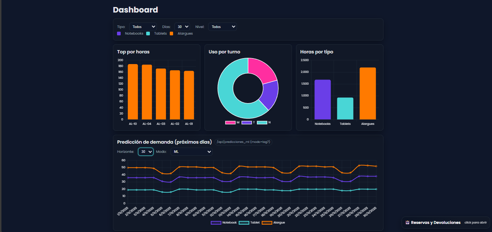
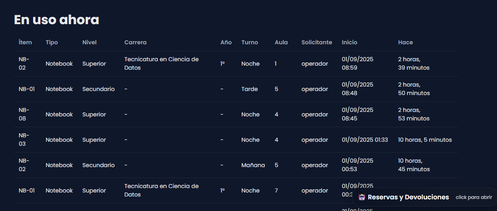
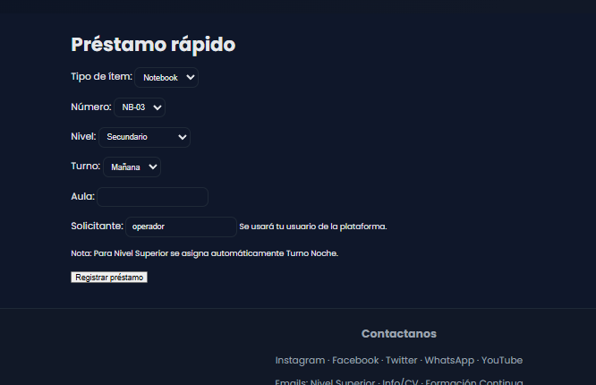
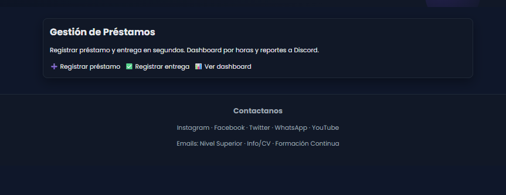

# ESIM Inventario

Sistema de inventario y préstamos (ESIM) en Django 4.2 con:
- Gestión de préstamos, devoluciones y reservas con aprobación.
- Dashboard con KPIs.
- Predicciones (IA/ML) de demanda y riesgo de tardanza.
- Chat asistente (embebido) para usuarios autenticados.
- Modo claro/oscuro y estilos unificados.

Índice
- Requisitos
- Instalación y arranque
- Estructura del proyecto
- Funcionalidades
- Modelos de datos
- Roles y permisos
- Dashboard
- Chat asistente
- API de Predicciones (ML)
- Explicabilidad (¿Cómo se calcula?)
- Datos sintéticos y entrenamiento ML
- Tareas programadas (opcional)
- Theming y modo oscuro
- Troubleshooting (errores comunes)
- Roadmap

Requisitos
- Python 3.12
- Pip + venv
- SQLite (incluido por defecto) u otra BD compatible
- Node no es necesario (Chart.js via CDN)

Dependencias (requirements.txt)
- Django==4.2.14
- djangorestframework==3.15.2
- whitenoise==6.7.0
- django-crontab==0.7.1
- numpy>=2.0,<2.3
- pandas>=2.2,<2.3
- scipy>=1.12,<1.15
- scikit-learn==1.5.1
- joblib>=1.3,<2.0
- threadpoolctl>=3.5.0

Instalación y arranque

1) Clonar y crear entorno
- git clone <repo>
- cd ESIM-Inventario
- python -m venv .venv
- .venv\Scripts\activate (Windows) | source .venv/bin/activate (Linux/Mac)
- pip install -r requirements.txt

2) Variables de entorno (opcional)
Crea .env (si usas python-dotenv) o configura desde el shell:
- DEBUG=True
- SECRET_KEY=tu_clave_segura
- ALLOWED_HOSTS=127.0.0.1,localhost
- TIME_ZONE=America/Argentina/Buenos_Aires

3) Migraciones y superusuario
- python manage.py makemigrations
- python manage.py migrate
- python manage.py createsuperuser

4) Arrancar
- python manage.py runserver
- http://127.0.0.1:8000/

Estructura del proyecto (parcial)
- config/ settings y urls del proyecto
- core/ app principal
  - models.py (Item, Prestamo, Reserva, Profile, etc.)
  - views.py (vistas + API + chatbot + predicciones ML)
  - ml_runtime.py (carga de modelos y generación de features en runtime)
  - management/commands/
    - seed_fake_data.py (datos sintéticos)
    - train_ml.py (entrena modelos)
    - eval_ml.py (evalúa modelos)
  - templates/
    - base.html (layout principal)
    - dashboard.html (KPIs y predicciones)
    - otras vistas (prestamos_activos, reservas_pendientes, etc.)
- templates/ base global (usada por el motor de plantillas)
- static/css/theme.css (tema claro/oscuro y estilos)

Funcionalidades

- Préstamos (Inicio y Devolución)
- Reservas con aprobación
  - Usuarios crean una reserva (asignada a un ítem) con expiración a las 23:00.
  - Staff (OPERADOR/STAFF o superuser) aprueba/convierte a préstamo en “Reservas pendientes”.
- Dashboard de uso:
  - Top por horas, uso por turno, horas por tipo, KPIs.
  - Predicción de demanda (modo lag7 recomendado).
  - Riesgo de devolución tardía (experimental).
  - Sección “¿Cómo se calcula?” para ver el desglose de contribuciones del modelo.
- Chat asistente (solo autenticados):
  - Reservar por código (NB-01, TB-03, etc.), listar/cancelar reservas.
  - Registrar devoluciones (si el usuario tiene ese préstamo activo).
  - Estado de conversación efímero en sesión.

Modelos de datos (core/models.py)
- Item(code, tipo, estado, uso_acumulado_horas, usos_acumulados, …)
- Prestamo(item, nivel, turno, aula, solicitante, inicio, fin_prevista, fin_real, estado, …)
  - método cerrar() actualiza estadísticas del ítem y lo deja disponible.
- Reserva(item, tipo, nivel, turno, aula, solicitante, expira, estado, …)
  - expirar(), cancelar(), aprobar_y_convertir()
- Profile(user, nivel, carrera, anio, discord_user_id)
- DiscordLinkToken(user, token, …) (opcional para integraciones)

Roles y permisos
- Usuarios autenticados:
  - Pueden iniciar préstamos (vista préstamo), devolver, crear reservas desde el chat.
- Staff (grupos OPERADOR, STAFF) y superuser:
  - Ven “En uso ahora” y “Reservas pendientes”.
  - Pueden aprobar/cancelar reservas (mostrador).
- Seguridad:
  - Widget del chat solo aparece para autenticados.
  - Endpoints sensibles con @login_required y CSRF.

Dashboard

- KPIs (GET /api/stats/kpis/)
  - top_items (por horas)
  - uso_por_turno
  - horas_por_tipo
  - métricas varias (duración promedio, en mantenimiento, etc.)
- Predicción de demanda (GET /api/predicciones_ml/?kind=demanda)
  - Modo lag7: promedio últimos 7 días por tipo/turno (recomendado y plano).
  - Modo dow: promedio histórico por día de semana (muestra dientes de sierra).
  - Modo lastweek: repite patrón de la última semana.
  - Modo ml / ensemble: modelo ML y mezcla con lag7.
- Riesgo de tardanza (experimental)
  - Predicción calibrada con bandas: bajo/medio/alto (umbrales configurables en query).

Chat asistente (embebido)

- Está incluido en templates/base.html y estilizado en static/css/theme.css
- Flujos:
  - “Reservar NB-01”: guía con nivel/carrera/año/aula, confirma y crea la reserva.
  - “Devolver NB-01/Entregar NB-01”: confirma y cierra préstamo del usuario si está activo.
  - “Mis reservas”, “Mis préstamos”, “Cancelar reserva”.
- Estado conversacional: efímero en session (no se persiste a BD).

API de Predicciones (ML)

1) Demanda
- GET /api/predicciones_ml/?kind=demanda&h=7&mode=lag7|ml|ensemble|dow|lastweek&w=0.6
Parámetros:
- h: horizonte en días (1–30).
- mode:
  - lag7 (default): valor plano = promedio 7 días.
  - dow: media histórica por día de semana.
  - lastweek: repite patrón de la semana pasada.
  - ml: modelo PoissonRegressor (IA).
  - ensemble: w*lag7 + (1-w)*ml (w por query).
Respuesta: lista de {date, tipo, turno, pred}.

2) Tardanza
- GET /api/predicciones_ml/?kind=tardanza&tipo=NB&nivel=SEC&turno=N&thr_med=0.4&thr_high=0.65&hour=18&dur=2.0&date=YYYY-MM-DD
Parámetros:
- tipo: NB | TB | AL
- nivel: SEC | SUP | PER
- turno: M | T | N
- hour, dur, date: opcionales para ajustar el contexto
- thr_med, thr_high: umbrales para bandas medio/alto
Respuesta: {score, tier (bajo/medio/alto), thresholds, experimental:true}

Notas de precisión:
- En tus métricas actuales, lag7 supera al ML en demanda (usa lag7 como default).
- Tardanza tiene señal moderada (AUC ~0.58); úsalo como ranking con avisos suaves.

Explicabilidad (¿Cómo se calcula?)

- GET /api/predicciones_ml/explain/
  - Demanda:
    - ?kind=demanda&date=YYYY-MM-DD&tipo=NB&turno=N&mode=ml&w=0.7
    - Devuelve contribuciones en escala log del modelo ML (Poisson).
  - Tardanza:
    - ?kind=tardanza&tipo=NB&nivel=SEC&turno=N&hour=18&dur=2&date=YYYY-MM-DD
    - Devuelve contribuciones de la regresión logística base (antes de calibración).
- El dashboard incluye una tarjeta “¿Cómo se calcula?” para consultar y mostrar top de features.

Datos sintéticos y entrenamiento ML

1) Generar históricos (seed)
- python manage.py seed_fake_data --days 365 --clear
Genera ítems (si faltan) y préstamos históricos con:
- estacionalidad semanal
- semanas de exámenes (junio/noviembre)
- mayor tardanza en noche/superior/cerca de 22:00

2) Entrenar modelos
- python manage.py train_ml
Guarda modelos en core/ml_models/
- demand_model.joblib (+ demand_meta.json con train_start_day)
- late_model.joblib (+ late_meta.json)

3) Evaluar (métricas)
- python manage.py eval_ml
Genera core/ml_models/metrics_report.json con:
- Demanda: MAE, RMSE, WAPE, sMAPE vs baselines (dow y lag7).
- Tardanza: AUC, AP, Brier, Acc, BalancedAcc; F1 en umbral 0.5 y umbral óptimo.

4) Consumir predicciones (front o curl)
- curl "http://127.0.0.1:8000/api/predicciones_ml/?kind=demanda&h=7&mode=lag7"
- curl "http://127.0.0.1:8000/api/predicciones_ml/?kind=tardanza&tipo=NB&nivel=SEC&turno=N&thr_med=0.2&thr_high=0.45"

Tareas programadas (opcional)

- Reentrenar semanalmente y evaluar:
  - django-crontab está instalado. Ejemplo de cron:
    - python manage.py crontab add
    - Define en settings.py CRONJOBS con:
      - ("0 3 * * 1", "django.core.management.call_command", ["train_ml"])
      - ("10 3 * * 1", "django.core.management.call_command", ["eval_ml"])

Theming y modo oscuro

- CSS centralizado en static/css/theme.css con variables CSS:
  - Modo claro por defecto.
  - Modo oscuro si el sistema lo prefiere o si el usuario toca el toggle (🌓 en nav).
- El chat está rediseñado para verse bien en ambos modos:
  - .chat-widget, .chat-card, .chat-bubble, .chat-chip, etc.

Troubleshooting

- TemplateDoesNotExist: base.html
  - Verifica config/settings.py: TEMPLATES.DIRS = [BASE_DIR / 'templates'] y APP_DIRS=True.
  - No pongas  dentro de base.html (crea recursión).
- CSRF 403 en /api/chat/:
  - El widget solo funciona bajo el mismo dominio/puerto. Asegurate de tener el cookie csrftoken.
- “columns are missing: {‘trend_idx’, ‘is_exam’}”:
  - Actualiza core/ml_runtime.py (demand_feature_row y late_feature_row devuelven todas las columnas esperadas).
  - Vuelve a entrenar para generar demand_meta.json con train_start_day.
- CalibratedClassifierCV “base_estimator”:
  - Usamos estimator= para scikit-learn>=1.3; hay fallback a base_estimator si tu versión es anterior.
- Gráfico de demanda “línea recta”:
  - Es normal en modo lag7. Usa “dow” o “lastweek” para ver estacionalidad semanal.

Roadmap (sugerencias)
- Demanda:
  - Ensemble como default (0.7 lag7 + 0.3 ML) si supera WAPE de lag7 durante varias semanas.
  - Modelos alternativos: HistGradientBoostingRegressor, Tweedie, validación temporal.
- Tardanza:
  - Más features operativas: reservas del día, disponibilidad, minutos hasta 23:00, feriados reales.
  - Calibración Platt/Isotónica ya incluida; probar árboles (HGB/XGBoost).
- Chat:
  - Permitir staff convertir reservas desde el chat (opcional).
  - Soporte de búsqueda natural (“buscar notebook python”).
- Auditoría:
  - Guardar historial de predicciones y performance real para seguimiento.

¿Dudas o sugerencias? Abrí un issue en el repo o contactá al responsable del proyecto.

 
 

